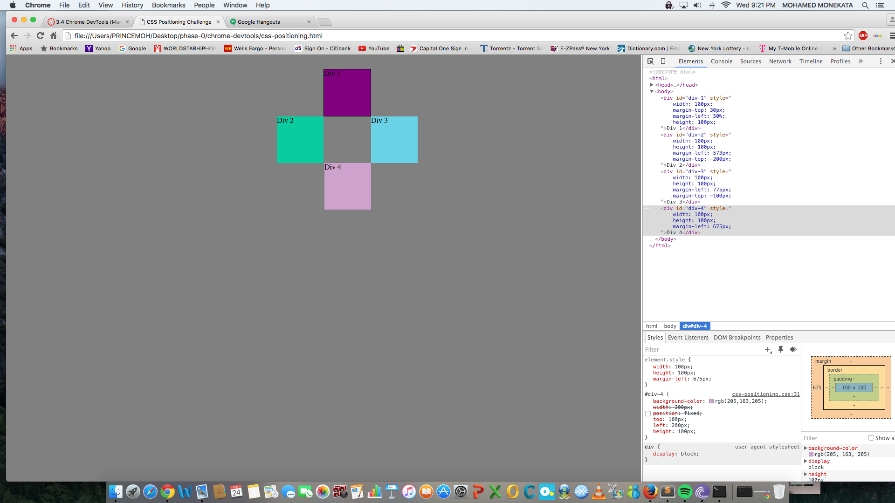

!
[Five](imgs/ex5.png)

##How can you use Chrome's DevTools inspector to help you format or position elements?
On the page you can select any element and do a right click and select inspect, that will open section where you edit format and change postions.
##How can you resize elements on the DOM using CSS?
In the CSS pane when you click on the Element.style, it gives the option to resize or modify elements.
##What are the differences between absolute, fixed, static, and relative positioning? Which did you find easiest to use? Which was most difficult?
The differences are : a fixed element doesn't move it stays put even when the page is scrolling, static is the default position of an element on a page, a relative element will move away from it normal position, and an element that is positioned absolute moves relatively from it direct parent.
##What are the differences between margin, border, and padding?
Margin is the white space outside the border, the border is the layer that surrounds the elements, and it allows the styling an element's border.
##What was your impression of this challenge overall? (love, hate, and why?)
The challenge was actually my favorite, I really loved it, I got to with positionings from which I learned a lot.