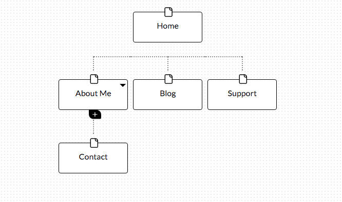

What are the 6 Phases of Web Design?
The 6 phases are:
1. Information Gathering
2. Planning
3. Design
4. Development
5.Testing and Delivery
6. Maintenance

What is your site's primary goal or purpose? What kind of content will your site feature?

My site' s goal is to find me a job, it will feature information about me, the skills I have, how experienced I am, what kind of education I have, my achievements and my working style.

What are your target audience’s interests and how do you see your site addressing them?

The targets are potential employers; I want my site to address them with clear information on 
How I can be a right fit for them, and also give them the impression of exactly what they are looking for. 

What is the primary "action" the user should take when coming to your site? Do you want them to search for information, contact you, or see your portfolio? It's ok to have several actions at once, or different actions for different kinds of visitors.

I think it's up to the user to take any primary action they wish to, my job will be to make all those actions immediately available once they are on my site

What are the main things someone should know about design and user experience?

It's important to know that user experience design cannot meet everybody' s expectations, as individuals we are all different, for instance; if Janet thinks that some site is awesome, Paul might feel differently. So this is to say that UX is not there to achieve perfection but rather delivers qualities where it is crucial. In addition, we cannot measure how users like a site, for example we cannot refer to number of views and subscription to evaluate the likability of a website. Another thing is that it's important distinguish the difference between user experience and usability because they are two different things. UX focuses on how a user feels about a system, while usability is about how friendly a system is.

What is user experience design and why is it valuable? 

User experience can be defined as the feeling a user get when using a system or interface. it is valuable because it can make a site very successful. Although It costs more money to bring UX, it can be rewarding later on, for example the sites for ecommerce could gain more customers by implementing UX.

Which parts of the challenge did you find tedious?

Writing the reflections is always tedious for me. English being a third language for me, I try to make the content as clear as possible to my audience. As a result, it's very time consuming; I always spend like couple of hours on them. But everything else was fine.

