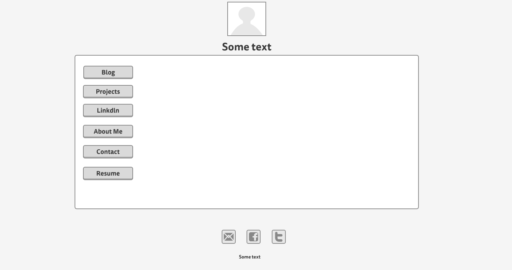

What is a wireframe?

A wire is a prototype structure of your design that will help you during the layout stage; it is a really important part of a screen design. Perhaps the most important part of the process is to take account of how a user will interact with the interface. In other words, a wireframe is like a blueprint for web design, an early step that makes the designing much easier. 

What are the benefits of wireframing?

*It offers a clear hierarchy of a design.
*You won't have to worry about the structure of your design during coding stage.
*Make the life of some designers easier. It’s also possible to produce great designs without wireframing
*You have something to start with.

Did you enjoy wireframing your site?

Yes, I really enjoyed because I learned a lot of stuff. I always wondered how a web site is designed and I got some answers doing this challenge.

Did you revise your wireframe or stick with your first idea?

No, I haven't revised it yet but I plan to do so when I get a chance.

What questions did you ask during this challenge? What resources did you find to help you answer them?

I asked myself if it is possible to be a successful designer without doing wireframeming. In an article, I read some designers' stories, some use wireframing and others don't and they are both doing well it all depends on the person.

Which parts of the challenge did you enjoy and which parts did you find tedious?

I enjoyed working on my site and my blog because I got to play with a wireframing tool for the first time, it was a great experience due to the fact I didn't even know they existed. 

